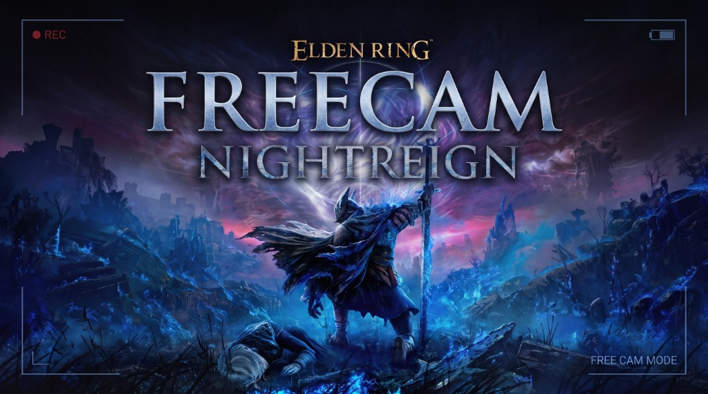

# Elden Ring Nightreign — Freecam

A standalone, high-performance Freecam and camera manipulation toolkit for **ELDEN RING: NIGHTREIGN**, written in Rust.

Designed for virtual photography, cinematic content creation, and world inspection with pure keyboard & mouse control, zero-velocity Havok teleportation, fall-death prevention, and an integrated translucent in-game OSD guide.

---

## Video Demonstration

[](https://www.youtube.com/watch?v=MXerz9vuJdk)

> 🎬 **Watch the full demonstration on YouTube:** [Elden Ring Nightreign Freecam Mod Demo](https://www.youtube.com/watch?v=MXerz9vuJdk)

---

## Supported Game Versions

> [!IMPORTANT]
> This mod is strictly and exclusively compatible with:
> - **ELDEN RING: NIGHTREIGN version `1.3.3.0`**
> - **ELDEN RING: NIGHTREIGN version `1.3.2.0`**
>
> Other game versions are not supported due to game memory offsets and engine structures.

---

## Features

- **Pure Keyboard & Mouse Control:** Complete 6-axis camera navigation (movement, elevation, rotation, roll) with zero joystick dependency.
- **360° Unconstrained Free Look:** Unlimited pitch, yaw, and roll without mouse deadzones or viewport locking.
- **Translucent In-Game Guide (OSD):** Built-in layered HUD guide displaying keybindings on screen. Uses `WS_EX_TRANSPARENT` pass-through, meaning clicks pass directly into the game without stealing focus. Automatically closes when the game exits.
- **Safe Teleport (`T`):** Teleports the character precisely to the camera's coordinates with zero residual root-motion velocity and immediately disables freecam for a seamless transition.
- **Permanent Fall Death Protection:** Fall-death timers are suppressed so the player character never dies from long drops while navigating or landing.
- **Emergency Rescue (`Home` / `Backspace`):** Instantly teleports the character back to the initial spawn position in case of accidental drops out of bounds.

---

## Controls

All controls are operated via Keyboard and Mouse:

| Key / Input | Action | Description |
| :--- | :--- | :--- |
| **`P`** or **`F1`** | **Toggle Freecam** | Activates or deactivates the free camera mode |
| **`W`**, **`A`**, **`S`**, **`D`** | **Move Camera** | Fly forward, strafe left, backward, or right |
| **`Space`** | **Fly Up** | Elevate camera vertically |
| **`Ctrl`** or **`C`** | **Fly Down** | Lower camera vertically |
| **`Shift`** | **Speed Boost** | Accelerate camera speed by 3.5× |
| **`Alt`** | **Precision Speed** | Slow camera speed by 0.25× for fine positioning |
| **`Mouse`** | **Look 360°** | Full camera orientation (Yaw and Pitch) |
| **`Q`** / **`E`** | **Roll Camera** | Tilt camera angle left or right |
| **`R`** | **Reset Roll** | Reset camera roll back to 0° level horizon |
| **`T`** | **Teleport & Land** | Teleport character to camera position, land safely, and exit freecam |
| **`Home`** or **`Backspace`** | **Rescue to Origin** | Emergency return to the initial world spawn location |
| **`H`** or **`F2`** | **Toggle Guide (OSD)** | Show or hide the translucent on-screen key guide |

---

## Installation & How to Use

Follow these clear step-by-step instructions to install and use the Freecam:

### Step 1: Download the Files
Go to the **[Releases](https://github.com/carlosjrgit/Nightreign_Freecam/releases)** page and download the two required files:
- **`FreecamLauncher.exe`**
- **`Freecam.dll`**

*(No installation scripts, external mod loaders, or batch files are needed!)*

---

### Step 2: Place Files in the Game Folder
Copy both **`FreecamLauncher.exe`** and **`Freecam.dll`** directly into your **`Game`** directory (the folder where `nightreign.exe` is located).

Example directory structure:
```text
ELDEN RING NIGHTREIGN/
└── Game/
    ├── nightreign.exe
    ├── FreecamLauncher.exe   <-- Place here
    └── Freecam.dll           <-- Place here
```

---

### Step 3: Launch Order (Important!)
1. **Start the Game First:** Open *ELDEN RING: NIGHTREIGN* normally.
2. **Load your Character:** Navigate past the title and main menu, load your save game, and make sure your character is fully loaded and standing in the game world.
3. **Run the Launcher as Administrator:** While the game is running with your character loaded, right-click **`FreecamLauncher.exe`** inside the `Game` folder and click **Run as administrator**.
4. The launcher will automatically find the `nightreign.exe` process, inject `Freecam.dll`, and display a success message.

---

### Step 4: Use Freecam
Switch back to the game window:
- Press **`P`** or **`F1`** to toggle Freecam on or off.
- An in-game transparent guide will appear on the side showing the controls. Press **`H`** or **`F2`** to hide or show this guide at any time.
- Fly around freely with **`W`**, **`A`**, **`S`**, **`D`**, ascend with **`Space`**, descend with **`Ctrl`**, and rotate with the **`Mouse`**!

---

## Building from Source

To compile the binaries yourself from source code:

### Prerequisites
- [Rust](https://www.rust-lang.org/) (2021 edition or newer)
- Target toolchain for Windows: `x86_64-pc-windows-gnu` or `x86_64-pc-windows-msvc`

### Build Command
```powershell
# Clone the repository
git clone https://github.com/carlosjrgit/Nightreign_Freecam.git
cd Nightreign_Freecam

# Build the release profile
cargo build --target x86_64-pc-windows-gnu -p nightreign-freecam --release
```

The compiled binaries will be generated at:
- Launcher: `target/x86_64-pc-windows-gnu/release/FreecamLauncher.exe`
- Library: `target/x86_64-pc-windows-gnu/release/nightreign_freecam.dll` (rename to `Freecam.dll` for distribution)

---

## Project Structure

```text
├── assets/                  # Presentation banner & visual assets
├── crates/
│   ├── eldenring/           # Elden Ring engine structure definitions
│   ├── nightreign/          # Nightreign memory signatures, RVA tables & classes
│   └── shared/              # Shared FromSoftware runtime utilities & math
├── examples/
│   └── nightreign-freecam/  # Main Freecam project
│       ├── src/
│       │   ├── bin/
│       │   │   └── injector.rs   # FreecamLauncher.exe source
│       │   └── lib.rs            # Freecam.dll source (camera logic, Havok sync & OSD)
│       └── Cargo.toml
├── Cargo.toml
└── README.md
```

---

## Security & Integrity

- Every binary asset published in official [GitHub Releases](https://github.com/carlosjrgit/Nightreign_Freecam/releases) is accompanied by verified **SHA-256 checksums**.
- Source code is completely open for public inspection and contains zero proprietary keys, telemetry, or external network requests.
- Binaries are unsigned open-source tools; standard Windows SmartScreen alerts can be bypassed by clicking *"More info"* → *"Run anyway"*.

---

## License & Credits

- Underlying engine reverse-engineering runtime bindings built on `fromsoftware-rs` by `vswarte`.
- Community reverse engineering contributions by Dasaav, Tremwil, Sfix, Yui, and Vawser.
- Licensed under [MIT](LICENSE-MIT) OR [Apache-2.0](LICENSE-ASL2).
